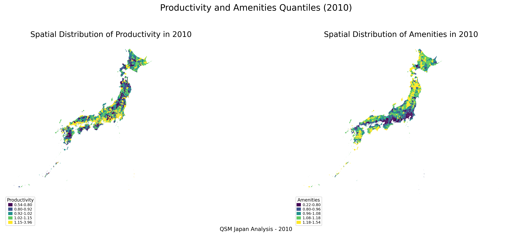
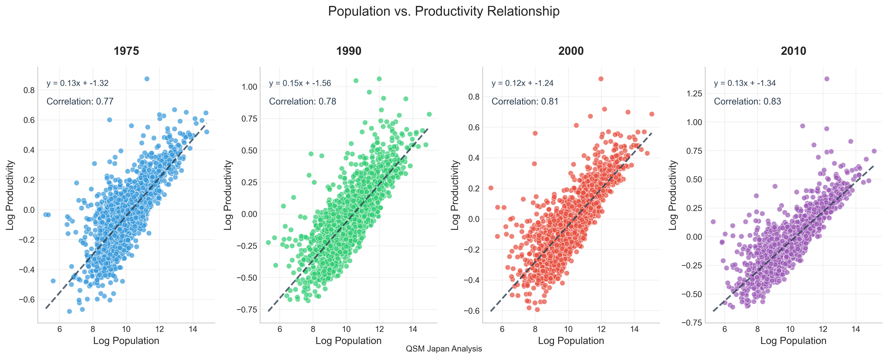
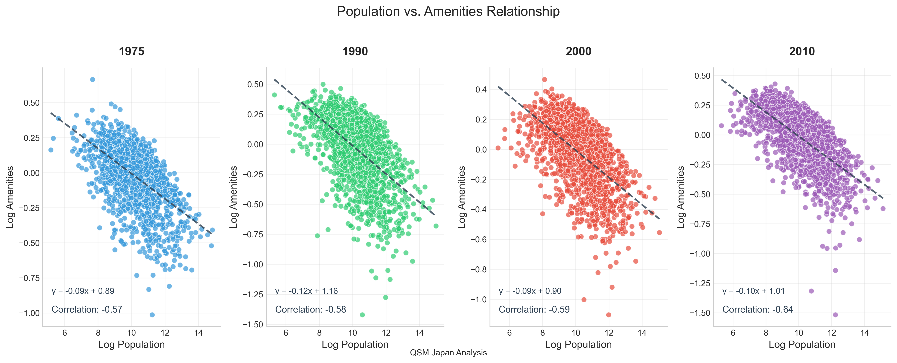

# Quantitative Spatial Model (QSM) for Japan

This repository contains a Quantitative Spatial Model analysis for Japan, examining spatial economic patterns across Japanese cities from 1975 to 2010.

## Project Overview

This project implements a Quantitative Spatial Model based on the framework developed by Allen and Arkolakis (2014). The model analyzes:

- Population and wage data across Japanese cities
- Spatial economic patterns and their evolution over time
- Productivity and amenity calculations

## Data

The data directory contains:
- Population data from 1970-2010
- Wage data from 1975-2014
- Shapefiles for Japanese cities
- Generated amenities and productivity data

## Code Structure

The codebase is organized into modular Python scripts:

### Main Scripts

- `Japan/Scripts/main.py`: Main script that runs the entire pipeline
- `Japan/Scripts/data_preparation.py`: Loads and merges population and wage data
- `Japan/Scripts/spatial_processing.py`: Processes spatial data and calculates distances
- `Japan/Scripts/model_inversion.py`: Implements the model inversion procedure
- `Japan/Scripts/visualization.py`: Creates visualizations of the results
- `Japan/Scripts/utils.py`: Contains utility functions used across scripts

### Jupyter Notebook

- `Japan/Code/QSM_Japan.ipynb`: Original Jupyter notebook with the complete analysis

## Results

The model calculates productivity and amenity values for Japanese cities, providing insights into spatial economic patterns and their changes over time.

### Key Findings

1. **Productivity-Population Relationship**: There is a positive correlation between population and productivity across Japanese municipalities, consistent with agglomeration effects.

2. **Spatial Distribution**: Productivity and amenities show distinct spatial patterns, with higher values concentrated in major urban centers.

3. **Temporal Evolution**: The relationship between population and productivity has evolved over time, with changes in correlation strength across decades.

### Visualizations

#### Productivity and Amenities Maps (2000)


#### Population vs. Productivity Scatter Plots


#### Population vs. Amenity Scatter Plots



## Usage

### Running the Full Pipeline

```bash
cd Japan/Scripts
python main.py
```

### Running Specific Steps

You can skip specific steps using the `--skip-steps` argument:

```bash
python main.py --skip-steps data,spatial
```

Available steps: `data`, `spatial`, `model`, `viz`

### Processing Specific Years

You can process specific years using the `--years` argument:

```bash
python main.py --years 1975,1990,2010
```

## References

- Allen, T., & Arkolakis, C. (2014). Trade and the Topography of the Spatial Economy. The Quarterly Journal of Economics, 129(3), 1085-1140. 

## Setup

1. Clone this repository:
   ```
   git clone https://github.com/ShizukaInoue/QSM.git
   cd QSM
   ```

2. Create a virtual environment and install dependencies:
   ```
   python -m venv env
   source env/bin/activate  # On Windows: env\Scripts\activate
   pip install -r requirements.txt
   ```

3. Run the analysis:
   ```
   cd Japan/Scripts
   python main.py
   ```

### Note on File Paths

The scripts use relative paths to access data files. All data files should be placed in the `Japan/Data` directory as described in the "How to Obtain the Data" section.

## Data Files

Note: Large data files are not included in this repository due to size constraints. The required data files include:
- Population data (1970-2010)
- Wage data (1975-2014)
- Shapefiles for Japanese prefectures

### How to Obtain the Data

To run this analysis, you'll need to download the following data:

1. **Population Data (1970-2010) and Wage Data (1975-2014)**
   - Source: [Cabinet Office of Japan](https://www5.cao.go.jp/keizai-shimon/kaigi/special/future/keizai-jinkou_data.html)
   - This official government website provides comprehensive municipal-level data for Japan, including:
     - Population data from the Census (人口総数：総務省『国勢調査』)
     - Economic indicators including wage data
   - Download the Excel files for population and wage data
   - Save as `population 1970 2010.xls` and `average wage 1975_2014.xls` in the `Japan/Data` directory

2. **Shapefiles for Japanese Prefectures**
   - Source: [National Land Numerical Information](https://nlftp.mlit.go.jp/ksj/index.html) (MLIT)
   - Download the administrative boundary data for Japan
   - Create directories `Japan/Data/jpn1975` and `Japan/Data/jpn2014`
   - Extract the shapefiles into these directories

If you need assistance accessing these data sources, please contact the repository owner.

## Model Details

The Quantitative Spatial Model (QSM) used in this analysis is based on the equilibrium conditions from Allen and Arkolakis (2014). The model:

1. Processes data for years 1975-2010 in 5-year intervals
2. Calculates productivity and amenity values for each prefecture
3. Analyzes spatial patterns and their evolution over time
4. Visualizes results using maps and charts


